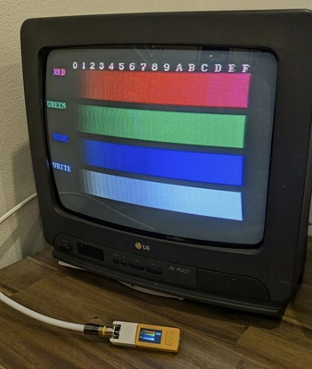
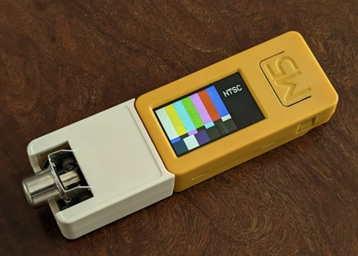

# M5Stack-CompositeTestPatternGenerator

    

A portable composite video test pattern generator using the [M5StickC PLUS2 ESP32 controller](https://shop.m5stack.com/products/m5stickc-plus2-esp32-mini-iot-development-kit). This tool is aimed to be used as a quick and portable way of performing tests of basic functionality for CRT TVs.

Features:
- PAL/NTSC support
- Multiple test patterns
- 16-bit colour (RGB565)
- Built-in battery and screen

## Building a Board

(TODO)

The schematic is available [here]() (TODO).

## Uploading the Firmware

Navigate to the [Installation page]() (TODO) to connect to your device and flash the firmware from your browser directly.   

You'll need to install [CH340 drivers](https://www.wch-ic.com/downloads/CH341SER_ZIP.html) in order to connect to your device.

## How to Use

Power the device on by holding the small power button on the left side, and connect the composite cable to you CRT TV. Cycle through test patterns with the large face button, and toggle between video formats with the small button on the right side. 

Power the device off by holding the small power button for 5 seconds.

The device will remember the last video format so you don't need to toggle it to your region every time it boots.

## Acknowledgements

- [lovyan03](https://github.com/lovyan03) for their [LovyanGFX](https://github.com/lovyan03/LovyanGFX) library
- [Artemio Urbina](https://github.com/ArtemioUrbina) for his test patterns 
