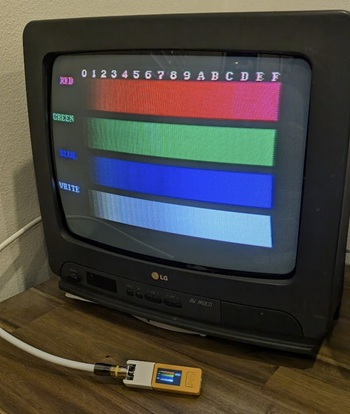
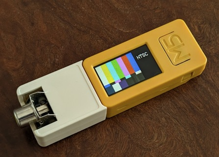

# M5Stack-CompositeTestPatternGenerator

[](./img/demonstration.jpg)    [](./img/device.jpg)

A portable composite video test pattern generator for the original
ESP32-based M5StickC Plus family. It provides a quick way to perform basic CRT
TV checks when connecting an entire console would be inconvenient.

The firmware does not require PSRAM. Pattern images are stored as compact,
lossless RGB565 assets and rendered one scanline at a time from internal RAM.

Features:

- PAL/NTSC support
- Eight test patterns
- 16-bit colour (RGB565)
- Built-in battery and screen

## Device compatibility

| Device | Status |
|---|---|
| M5StickC Plus v1 | Supported by the common no-PSRAM build |
| M5StickC Plus v1.1 | Expected to use the same hardware profile as Plus v1 |
| M5StickC Plus2 | Uses the common no-PSRAM build; validation of this revision is pending |
| M5StickC Plus SE | Experimental until it has been checked on hardware |
| ESP32-S3-based M5Stick devices | Not supported |

PlatformIO does not currently provide a dedicated Plus SE board manifest. The
project therefore uses the classic `m5stick-c` definition with an explicit
4 MB flash size, while M5GFX performs runtime display detection for the
original Plus family.

## Setting up the hardware

There are a couple of ways to assemble the composite adapter. See
[Setting up the hardware](docs/setting-up-hardware.md) for details.

The [schematic](plot/schematic.png) is also available in the repository.

## Building and uploading

Build the common Plus-family firmware from the repository root:

```sh
pio run -e m5stickc-plus-se-no-psram
```

Upload it to a connected device:

```sh
pio run -e m5stickc-plus-se-no-psram -t upload
```

The separate
[browser installation page](https://nmur.github.io/M5Stack-CompositeTestPatternGenerator-WebInstaller/)
provides published firmware builds. You may need to install the
[CH340 drivers](https://www.wch-ic.com/downloads/CH341SER_ZIP.html) before the
device can connect.

## How to use

Power the device on by holding the small power button on the left side, then
connect the composite cable to your CRT TV. Cycle through test patterns with
the large face button, and toggle between video formats with the small button
on the right side.

Power the device off by holding the small power button for 5 seconds.

The device remembers the last video format, so you do not need to select it
again every time it boots.

## Pattern assets

The eight 320×240 PNG files under `include/` are the editable source of truth.
Regenerate the compact C++ assets after changing a PNG:

```sh
python3 tools/generate_pattern_assets.py --write
```

Run the generator with no arguments (or `--check`) to confirm that the tracked
generated files are current:

```sh
python3 tools/generate_pattern_assets.py --check
```

The generator uses only the Python standard library. See the
[pattern asset format](docs/pattern-asset-format.md) before adding or changing
a pattern.

## Roadmap

- [ ] More patterns
- [ ] Scrolling tests
- [ ] Custom image support

## Acknowledgements

- [lovyan03](https://github.com/lovyan03) for [LovyanGFX](https://github.com/lovyan03/LovyanGFX)
- [Artemio Urbina](https://github.com/ArtemioUrbina) for his test patterns
